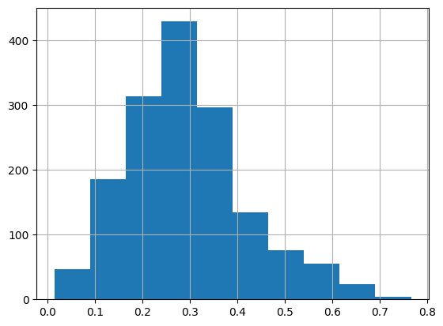

# Tirage au sort géo-social pour constituer le Collège Citoyen - Archipel Citoyen - Municipales 2026

L'objectif ici est de 

Un postulat de départ de création de ce processus s’inspire du concept de classe géo-sociale utilisé par Cagé & Piketty (2023 ; https://www.unehistoireduconflitpolitique.fr/glossaire.html). L’idée est ici qu’il y a une forte corrélation entre où l’on vit et ce que l’on vit, que la classe sociale combinée à l’endroit précis où l’on vit dit beaucoup de quelqu’un. Que les deux sont liés mais qu’ensemble ils ont une richesse qui dépasse la plupart des autres « indicateurs ».

A partir de ce postulat, nous avons donc exploité, à l’échelle de Toulouse, les données carroyées de l’INSEE : des carreaux de 200 m x 200 m pour lesquelles nous pouvons avoir accès à de nombreuses statistiques (revenu, statut locataire vs. Propriétaire, etc) qui disent beaucoup de ces micro-quartiers de la taille d’à peine 4 terrains de football. Ces données permettent aussi de s’extraire d’une pensée simpliste qui a structuré la « politique de la ville » et ses grands ensembles.

Nous allons donc extraire les données sur l’ensemble de la municipalité Toulousaine, pour différentes variables, afin de construire un `indicateur d'invisibilisation`.

## Les données source

INSEE - [Revenus, pauvreté et niveau de vie en 2019](https://www.insee.fr/fr/statistiques/7655475?sommaire=7655515) - Données carroyées - Dispositif Fichier localisé social et fiscal (Filosofi). 

Il n'existe malheureusement pas de données plus récente avec ce niveau de détail géographique et dans le contenu. Cependant, les évolutions sur les statistiques mesurées ici sont relativement lentes et nous pouvons donc partir du principe qu'elles restent très proche de la réalité de 2025.

## 🧩 Variables pertinentes utilisées et pondérations associées

|        **Indicateur**           | **Variable source**  | **Pondération** |   |
| ------------------------------- | -------------------- | --------------- | - |
| Taux de ménages pauvres         | `men_pauv`           |        3        |   |
| Taux de ménages monoparentaux   | `men_fmp`            |        2        |   |
| Taux d’individus de 18 à 24 ans | `ind_18_24`          |        1        |   |
| Taux de logements sociaux       | `log_soc`            |        2        |   |
| Taux de logements collectifs    | `men_coll`           |        1        | ([Insee][1], [Wikipedia][2]) |

[1]: https://www.insee.fr/fr/metadonnees/definition/c1653?utm_source=chatgpt.com "Définition - Pauvreté monétaire / Seuil de pauvreté / Seuil de ... - Insee"
[2]: https://fr.wikipedia.org/wiki/Pauvret%C3%A9_en_France?utm_source=chatgpt.com "Pauvreté en France"

Nous avons choisi un seuil à 0.5 -> nous ne gardons que les carreaux INSEE ayant une valeur supérieure à 0.5 pour le tirage au sort des localisations.